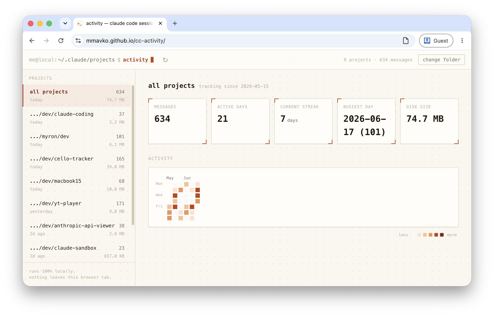

# cc-activity

GitHub shows you a calendar heatmap of how often you commit. This is the
same idea, pointed at [Claude Code](https://claude.com/claude-code) instead
of git: a heatmap of how many messages you've actually typed into Claude
Code, per day, per project and in aggregate.

It reads straight from your local `~/.claude/projects` session logs and
runs entirely in your browser tab — no server, no account, no data leaving
your machine.



**Live**: https://mmavko.github.io/cc-activity/

## Using it

Open the link above (or `docs/index.html` directly from a clone) in a
Chromium-based browser — Chrome, Edge, Arc, Brave. Firefox and Safari don't
support the File System Access API this relies on.

Click through and select your `~/.claude/projects` folder when prompted.
That's it — everything after that is computed locally.

## Heads up: Claude Code prunes old sessions

By default, Claude Code deletes session transcripts after 30 days
(`cleanupPeriodDays`), so this tool can only ever show what's still on disk.
If you want more history to accumulate going forward, raise that limit in
`~/.claude/settings.json`:

```diff
 {
   "env": {
     "CLAUDE_CODE_EXPERIMENTAL_AGENT_TEAMS": "1"
   },
+  "cleanupPeriodDays": 3650,
   "permissions": {
     "allow": []
   }
 }
```

(`3650` ≈ 10 years — pick whatever you like, it just needs to be a positive
integer.) This only affects retention from now on; sessions already deleted
are gone.

## More detail

See [`SPEC.md`](SPEC.md) for how it's built — filtering rules, data
sources, UI behavior, and known limitations.
